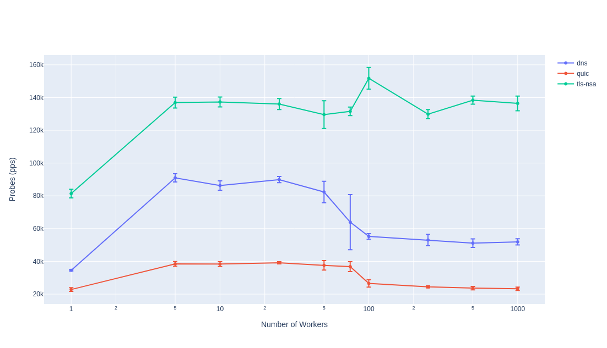
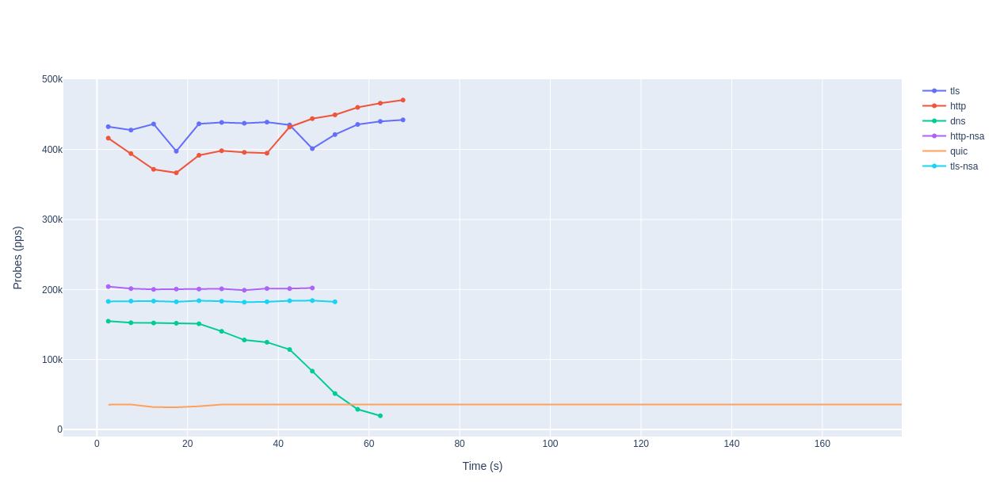

# Bidirectional Injection Benchmark

We want to evaluate the packet injection tool to answer a few questions about
the rate and consistency with which it injects packets.

Because of the high performance nature of the injection an expected difference
in packet injection rate depends on the time it takes to generate a payload. For
example generating a Quic probe requires an HKDF operation to generate the
initial keys, while http is created with a single format string operation.

Along with this we are still using golang `net.Dial` for sending DNS packets
(and raw sockets for all others) which has its own drawbacks.

## 1. How many packets can we send per second for each probe type?

Answering this question effectively means answering the question **How many
workers should we be using?**

To answer this we use `run.sh` which sets all send delays to 0 and points the
prober at a virtual interface, sending probes as fast as possible. We check the
reported send rate for a variety of worker values.

It seems like 5-50 workers is the ideal window (need to confirm this). This
could be caused by context switching and blocking for access to the raw socket
file descriptor. Maybe once we have a certain number of threads the access slows
down for all of them.

## 2. Is the rate at which packets are sent relatively stable throughout?

## 3. Send rates for the real measurements

TODO:

- v0.2 Run of Q1 will all (http, http-nsa, tls ,tls-nsa, quic, dns) probes
  - run on server with no other processing load (i had a zoom call start during experiment)
- v0.1 plot for Q2
